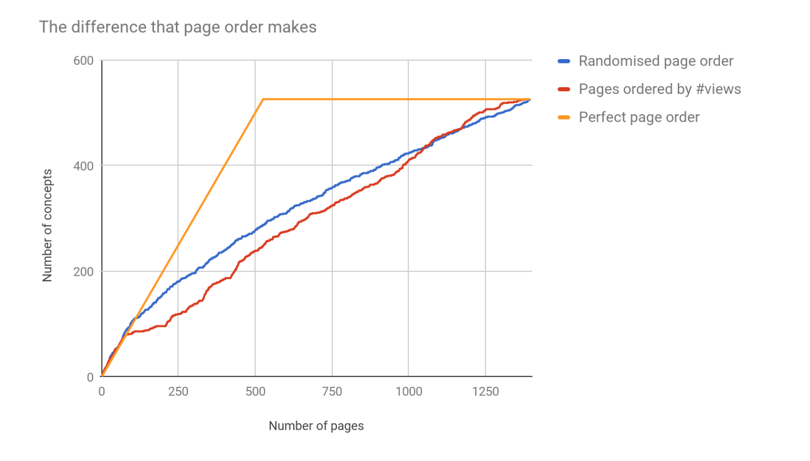

# How we used data science to accelerate our taxonomy creation

September 2017 - [Tom Gladhill](https://github.com/whoojemaflip) & [Tijmen Brommet](https://github.com/tijmenb)

We're working to improve the way GOV.UK goes about [building a navigation taxonomy](https://insidegovuk.blog.gov.uk/2016/04/14/building-a-new-tagging-infrastructure-for-gov-uk/). The taxonomy will cover every area of government content. from education to transport. When finished it will [help our users to navigate](https://insidegovuk.blog.gov.uk/2015/10/27/improving-navigation-on-gov-uk/) the large volume of content on the site.

There is now over 300,000 pages of content on www.gov.uk - uploaded by over 1,000 government departments and agencies. One of the challenges we face as a team is to understand what this content is really about. Initially, we thought that by reading each page and jotting some notes down we'd form a good overall understanding of the nature of the content. But when we sat down with a list of all of the content relating to even a narrow theme, we quickly realised there was no way our small team of developers and content designers could get through every item. We were working towards developing a taxonomy for the environmental content on GOV.UK, and this theme alone contained months of reading.

So we put our heads together and decided that, as per the [pareto principle](https://en.wikipedia.org/wiki/Pareto_principle), we should find around 80% of the theme's concepts in just 20% of the pages. That'd be enough to get us started on building the branch of the taxonomy for environment, and we should naturally discover the rest of the concepts later on. We thought that if we tackled the most viewed pages first, we would have the highest chance of discovering all of the most important concepts. We were still looking at a list of almost 6,000 pages at this point, but it was a definite improvement.  Even a small reduction in the number of pages to review would greatly improve our team's velocity of creating this taxonomy.

We set out to further reduce this number. Based on the [previously mapped and tagged Education theme](https://insidegovuk.blog.gov.uk/2017/03/21/presenting-our-new-taxonomy-beta), we looked at the rate of new concept discovery. Below is a plot of the total number of new concepts found against the number of pages reviewed for a single branch of our taxonomy. You can see the line flatten towards the upper right of the graph, as the rate of new concept discovery falls off. Would it be possible to predict when we could stop reviewing pages, based on this trend?

## Patterns in the data

What we found was that while it's hard to predict when enough is enough from this data, we could see a pattern. The content list was originally ordered by the number of pageviews on the site: an ordering that actually compared poorly to random. But, we asked, what if we could find the order that allowed us to  generate a sufficient number of concepts by reviewing the least number of pages?

## 'Inverse similarity' selection

That led us to this question: can we use [machine learning](https://en.wikipedia.org/wiki/Machine_learning) to help pick the most different pages within a theme? If the answer was yes then the concept finding exercise should take less time, as there'd be fewer pages on the same topic to review.

As it happens, last year our team did a couple of experiments with natural language processing. Helped by the data team at GDS, we investigated the [usefulness of using machine learning to generate taxonomies](https://gdsdata.blog.gov.uk/2017/01/12/using-data-science-to-build-a-taxonomy-for-gov-uk/). This technology now provided us with a new way to tackle the problem in front of us.  We had learned what we needed from these past experiments, and successfully applied this knowledge to this newly understood problem.

We trialled this approach against the content tagged to the education branch of the taxonomy, and found [our new solution](https://github.com/alphagov/govuk-inverse-similarity) performed exactly as we'd hoped. We think the number of pages that need to be read has fallen from 20% to less than 5%, and we have a repeatable process that can be applied to future content themes.  

## Trying it out in anger

The pages are currently being used to generate the terms for our transport theme. This is turning out to be really useful. We may integrate this algorithm into any tools we build to support the taxonomy generation process.
